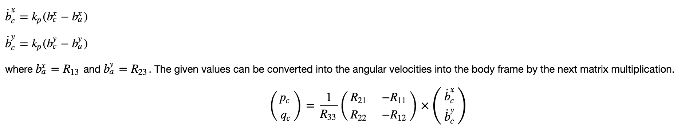
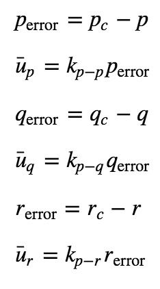
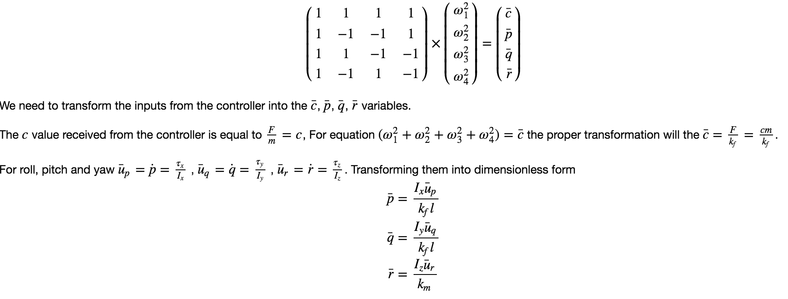
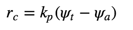
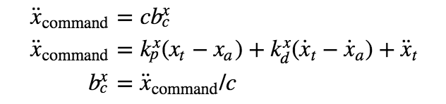
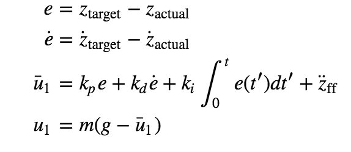

#  Controls Project README

## Scenario 1
I configured the mass in QuadControlParams.txt to .491 as I found it to be the most stable value for my drone.

## Scenario 2
The RollPitchControl function in QuadControl.cpp first calculates the pitch and roll angle rates given the current acceleration, altitude, and rotation of the vehicle which gives us our roll and pitch commands

Using the roll and pitch commands the desired body rate control was found in the QuadControl.cpp BodyRateControl function to find the appropriate roll, pitch, and yaw given the drone's current rates and moments of inertia.

Using the moments found, I implemented the "Setting the propeller angular velocities" equation in the QuadControl.cpp GenerateMotorCommands function to parse out the rotor translations from their commanded x, y, and z moments as described below.

Finally, I adjusted the angle rate gains and angle control gains to get the drone to perform as expected.

## Scenario 3
Implemented YawControl function based on current and desired yaw.

Found the LateralPositionControl values based on desired and current lateral acceloration and position and limted the commanded 
velocity and calculated acceloration to their extreme values.

I found the desired thrust (the total output of all 4 rotors)  by  comparing the command altitude by the commanded altitude, finding the integrated error and the rotation of the vehicle. This is then limited by the max ascent and decent rates and multiplied by the mass of the vehicle to determine thrust.

Finally, the position control gains and velocity control agins were adjusted.

## Scenario 4 + 5
Further refinements of the control parameters to match expected behavior.
